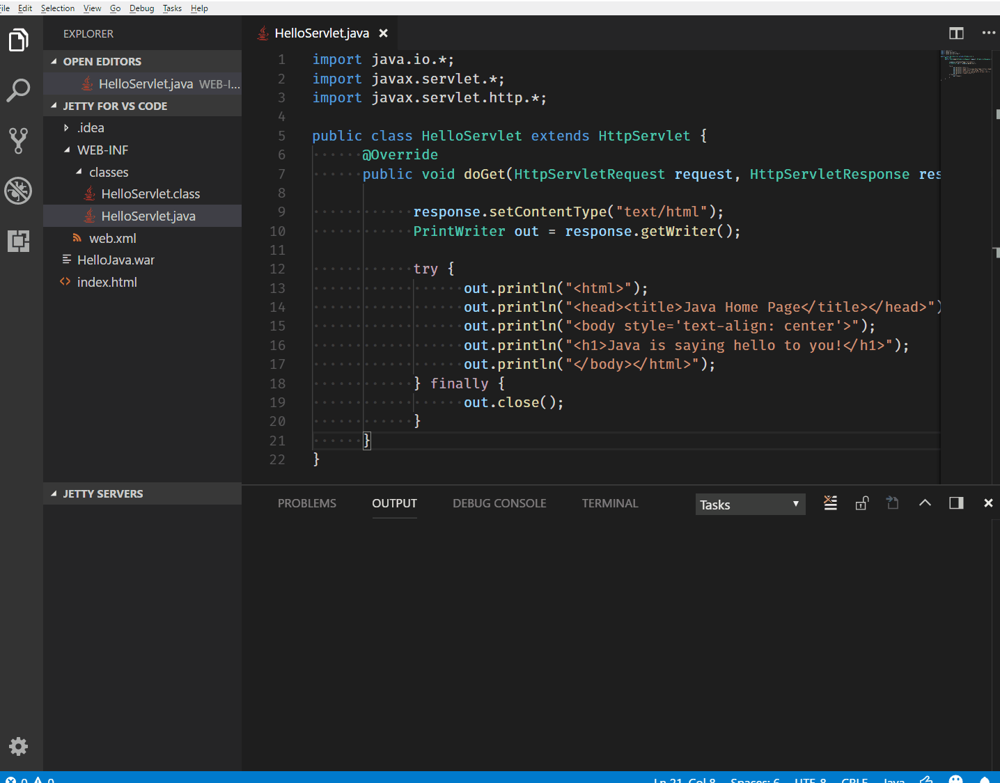

# Jetty for Visual Studio Code

## Usage
* 

## Prerequisites
* [Jetty Server](https://www.eclipse.org/jetty/)
* [Debugger for Java](https://marketplace.visualstudio.com/items?itemName=vscjava.vscode-java-debug)

## Features
* Add Jetty Server from download directory
* Start/Restart/Stop/Delete Jetty Server
* Run war package
* Debug war package
* Delete war package
* Reveal war package in file explorer
* Open Server homepage
* Open war package homepage

## Java Server Extension Pack

see <https://github.com/SummerSun/vscode-java-server-pack>

- [**Jetty**](https://marketplace.visualstudio.com/items?itemName=summersun.vscode-jetty)

- [Tomcat](https://marketplace.visualstudio.com/items?itemName=adashen.vscode-tomcat)

- Wildfly
  - To be done

## Release Notes
Refer to [CHANGELOG](CHANGELOG.md)
